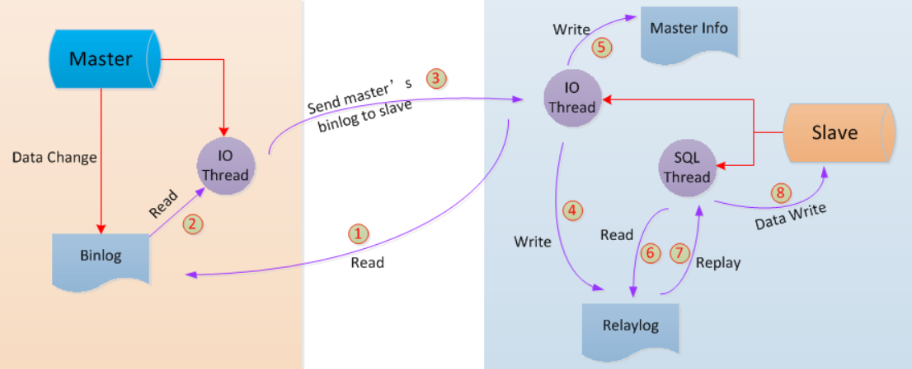
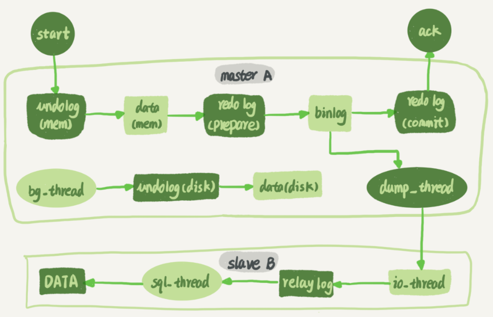

### Redis 数据结构

+ **SDS** 简单动态字符串

  ```c
  struct sdshdr {
      // 字符串长度 
      int len;
      // buf数组中未使用的字节数
      int free;
      // 字节数组，用于保存字符串
      char buf[];
  };
  ```

  + 与 c 相比，redis 通过 len 和 free 提升性能

    > 1. 获取长度时间复杂度O(1)
    > 2. 减少修改字符串时带来内存重分配次数

  + raw 和 embstr 编码的 SDS

    > 字符串长度小于39字节，编码类型 embstr；否则为 raw
    >
    > 区别：embstr 的 redisObject 和 sdshdr 地址连续；raw 不连续

+ **LinkedList** 双向无环链表 【前后指针】

+ **ZipList** 压缩列表

  > 经过压缩编码的由连续内存块组成的顺序型数据结构

  | zlbytes        | zltail                   | zlen     | entryX1...N | zlend      |
  | -------------- | ------------------------ | -------- | ----------- | ---------- |
  | 列表占用字节数 | 尾节点距离起始地址字节数 | 节点个数 | 各个节点    | 列表尾标志 |

+ **SkipList** 跳跃表

  ```c
  typedef struct zskiplistNode {
      // 后退指针
      struct zskiplistNode *backward;
      // 分值
      double score;
      // 成员对象
      robj *obj;
      // 层
      struct zskiplistLevel {
          // 前进指针
          struct zskiplistNode *forward;
          // 跨度
          unsigned int span;
      } level[];
  } zskiplistNode;
  ```

  + 上层节点个数是下层节点的一半（如何实现？随机层数）

  

  + 查找的时间复杂度 O(logN)

  

+ **HashTable** 哈希表 【数组 + 链表 + Entry<K,V>】

  + 渐进式 rehash 提高扩容性能

    > 在对哈希表增删改查操作过程中逐步迁移数据，每次迁移一个桶上所有数据
    >
    > 查: 先h[0] 没有则h[1]，增: 直接h[1]，删: 先[0] 没有则h[1]

+ **IntSet** 整数集合

  > 用于保存整数值，contents[] 不含重复项，按值从小到大排序  

  ``` c
  typedef struct intset {
      // 编码方式
      uint32_t encoding;
      // 集合包含的元素数量
      uint32_t length;
      // 保存元素的数组
      int8_t contents[];
  } intset;
  ```

  

### Redis 对象类型

>  对象类型redisObject结构体

```c
typedef struct redisObject {
    // 类型
    unsigned type:4;
    // 编码
    unsigned encoding:4;
    // 底层数据结构的指针
    void *ptr;
} robj;
```

+ **String** ：Int / SDS    【KV缓存、计数】
+ **List** ：ZipList / LinkedList    【消息队列】
+ **Hash** ： ZipList / HashTable    【关系型数据库表】 
+ **Set** ：IntSet / HashTable    【交集】
+ **ZSet** ：ZipList / SkipList    【排行榜】

> 操作指令：help @redisObject


### Redis 线程模型

+ **单线程：事件驱动 + IO多路复用**

  

  > Redis 的文件事件处理器 Event Loop是基于事件驱动，是单线程模型
  > 同时，socket上基于IO多路复用产生事件源，也是单线程

  

+ **单线程与多线程**

  > Redis核心是数据存在内存中，由于内存iops很高，故使用单线程的效率更高，省去线程切换的开销
  >
  > 假设：CPU读取内存1MB数据，单线程耗时250us；一次线程上下文切换约1500ns，若1000个线程读...
  >
  > 相反，当下层iops慢速时（如磁盘、网络）应使用多线程。
  >
  > Redis 的性能瓶颈在网络 IO上，故6.0采用多线程来处理网络数据读写（事件处理执行命令仍是单线程）


#### Redis 缓存问题

+ **缓存雪崩**

  > 大量key同时失效（如缓存服务宕机），流量打到DB上
  >
  > 解决：事前哨兵主从，事中熔断限流，事后持久化恢复

+ **缓存击穿**

  > 单个热key过期瞬间，流量全部打到DB上。
  >
  > 解决：缓存无需更新时，热点数据设为永不过期；更新不频繁时，缓存查不到则加锁更新；更新频繁时定时异步任务

+ **缓存穿透**

  > 查询不存在的key（恶意攻击），流量每次打到DB上
  >
  > 解决：做标记，如布隆过滤器

+ **数据双写不一致**

  > todo


### Redis 过期策略

+ **惰性删除**

  > 在查询key的时候对过期时间进行检测，过期则删除

+ **定期删除**

  > 定时任务：随机获取一些key做检查和删除

+ **内存淘汰**

  > 当惰性和定期没把key删除时，则key当内存满时走内存淘汰机制 【eg：LRU最近最少使用】


### Redis 持久化

+ **RDB**

  

+ **AOF**